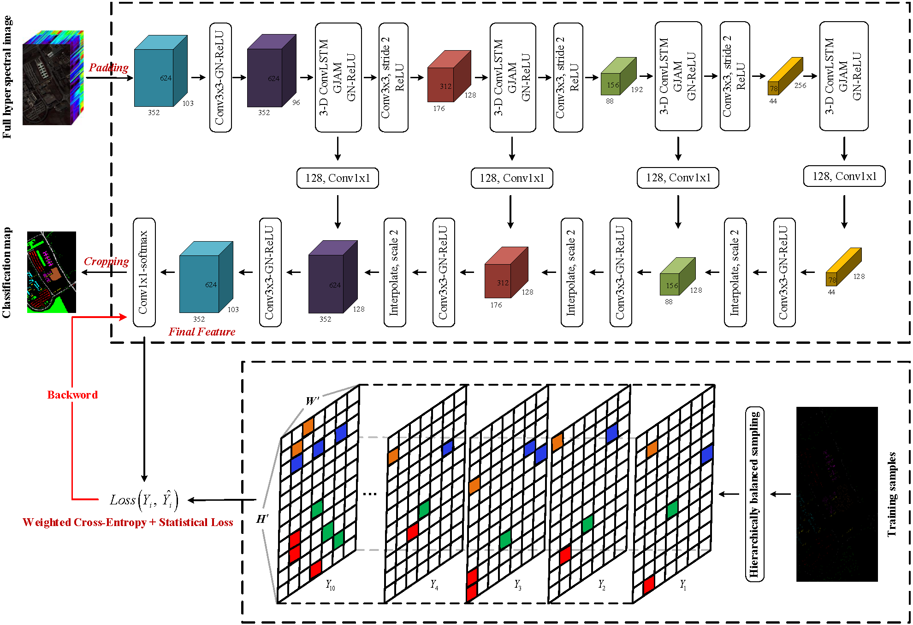
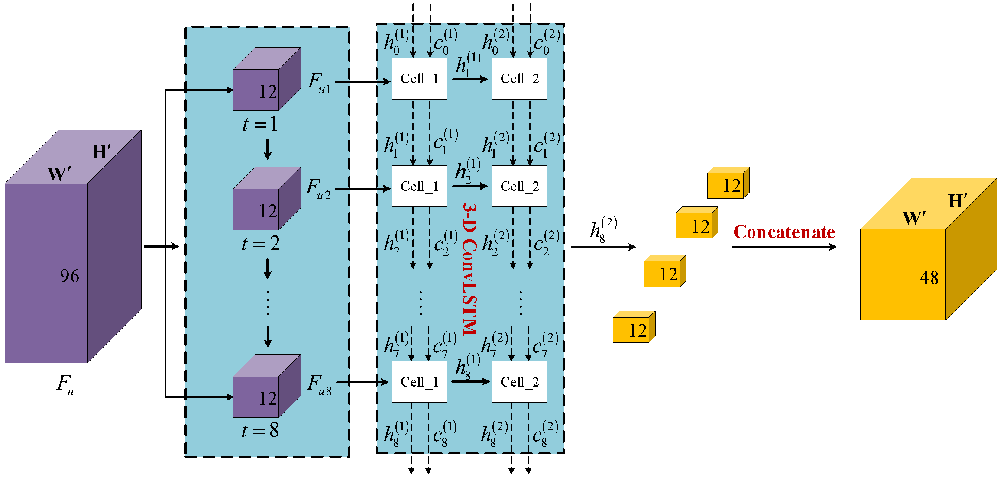

# RSSGL
RSSGL: Statistical Loss Regularized 3D ConvLSTM for Hyperspectral Image Classification

Code download link: [RSSGL code](https://github.com/swiftest/RSSGL).

Here is the bibliography info:
<br/>

```jason
@article{wang2022RSSGL,  
  title={RSSGL: Statistical Loss Regularized 3D ConvLSTM for Hyperspectral Image Classification},  
  author={Wang, Liguo and Wang, Heng and Wang, Lifeng and Wang, Xiaoyi and Shi, Yao and Cui, Ying},  
  journal={IEEE Transactions on Geoscience and Remote Sensing},  
  year={2022},  
  DOI (identifier)={10.1109/TGRS.2022.3174305},  
  publisher={IEEE}  
}
```

# Steps:
- 1. Run 'bash setup_script.sh' to download the data sets. Then, put the data sets and the ground truth into the corresponding folders.
- 2. Unizp the 'simplecv.zip' into your PYTHONPATH, or move the unzipped module to the 'site-packages' path.
- 3. Run 'bash ./scripts/....sh' to reproduce the experiments presented in the Paper.


# Descriptions
In this article, we develop a novel regularized spectral-spatial global learning (RSSGL) framework. Compared with SSDGL, the proposed framework mainly makes three improvements.



Fig1. Overall architecture of the proposed RSSGL. Given a full hyperspectral dataset of size H x W x B, where B indicates the number of spectral bands, the unified standardized input feature map is passed through 3D ConvLSTM to learn the short-range and long-range cross-channel dependencies and global spatial context features. Then, abundant spectral-spatial features are extracted through GJAM and group normalization (GN) is used to correct the inaccurate batch statistics estimation. Finally, the softmax layer is used for classification, and cross-entropy combined with statistical loss are used for error backward propagation.  




Fig2. The architecture of the 3D ConvLSTM.  


Fig3. The architecture of the 3D ConvLSTMCell.  

Compared with SSDGL, the proposed framework mainly makes three improvements. Above all, aiming at the problem that the GCL module used in SSDGL cannot fully tap the local spectral dependence, we apply 3D convolution to the gated units of long short-term memory (LSTM) as an alternative to the GCL module for adjacent and non-adjacent spectral dependencies learning. Furthermore, to extract the most discriminative features, an improved statistical loss regularization term is developed, in which we introduce a simple but effective diversity-promoting condition to make it more reasonable and suitable for deep metric learning in HSI classification. Finally, to effectively address the performance oscillation caused by the H-B sampling strategy, the proposed framework adopts an early stopping strategy to save and restore the optimal model parameters, making it more flexible and stable.

# Results  

## Indian Pines (IP) Data Set  
 

Fig.4  The IP data set classification result (OA: 96.73±0.095(%); AA: 97.60±0.111(%); Kappa: 0.9628±0.001) of RSSGL using fixed 5% samples for training (SEED=2333).

## Salinas (SA) Data Set 
 

Fig.5  The SA data set classification result (OA: 99.81±0.040(%); AA: 99.79±0.053(%); Kappa: 0.9980±0.000) of RSSGL using fixed 1% samples for training (SEED=2333).

## University of Pavia (UP) Data Set 
 

Fig.6  The UP data set classification result (OA: 99.47±0.080(%); AA: 99.12±0.252(%); Kappa: 0.9930±0.001) of RSSGL using fixed 1% samples for training (SEED=2333).

# Acknowledgement
This work was supported by National Natural Science Foundation of China (Grant No. 62071084, 62001434).
